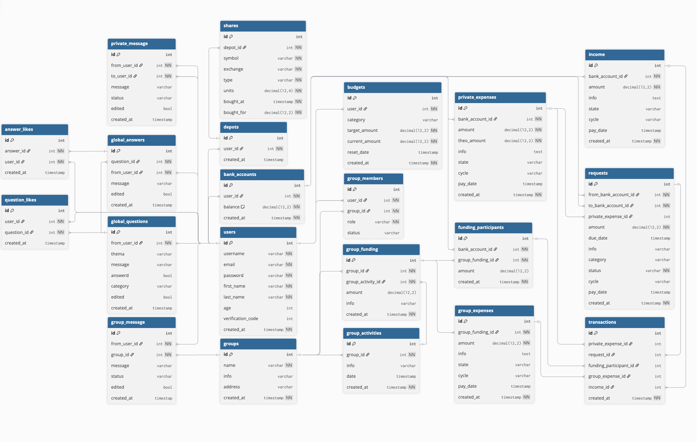

# FinanzApp 🚀💸📊

Willkommen zur aktuellen Projekt-README 🎯  
Ein zentraler Server steuert alle Module 🧠⚙️

## Module (aktuell) 🧩
- Login: `/` 🔐
- Dashboard: `/pages/dashboard/dashboard.html` 📈
- Gruppen: `/groups/` 👥
- Stocks: `/stocks/` 📉
- Fragen: `/questions/` ❓
- Konten: `/accounts/` 🏦

## Voraussetzungen ✅
1. Node.js 18+ 🟢
2. PostgreSQL/Supabase Datenbank (Zugriff via `DATABASE_URL`) 🐘
3. `.env` im Projekt-Root 📄

## Installation 📦
```bash
npm install
```

Hinweis: Die Anwendung nutzt aktuell PostgreSQL/Supabase via `DATABASE_URL`. Frühere MongoDB‑Hinweise sind historisch und für den aktuellen Code nicht relevant.

## Datenbank vorbereiten 🗄️
- Supabase Dashboard → SQL Editor → Datei `database/supabase-schema.sql` ausführen
- Alternativ: `npm run db:migrate` (zeigt Hinweise zur Ausführung)

## Starten ▶️
```bash
npm start
```

Danach:
- `http://localhost:3000/` 🔐
- `http://localhost:3000/pages/dashboard/dashboard.html` 📊
- `http://localhost:3000/groups/` 👥
- `http://localhost:3000/stocks/` 📉
- `http://localhost:3000/questions/` ❓
- `http://localhost:3000/accounts/` 🏦

## Nützliche Skripte 🛠️
- `npm start` (zentraler Server) ⚡
- `npm run db:check` (DB-Verbindung prüfen) 🧪
- `npm run db:migrate` (Hinweise zum Supabase-Schema – No‑Op, gibt nur Anweisungen aus) 🧱
- `npm run db:clear` (Platzhalter – No‑Op, führt keine Löschung aus) 🧹
- `npm run lint` (ESLint prüfen) ✨

## Aktueller Datenstruktur-Stand 🧭🗂️


## Relevante Struktur 📁
```text
FinanzApp/
  backend/server.mjs
  frontend/
    dashboard/
    groups/
    stocks/
    questions/
    accounts/
    shared/
    data/
  database/
  Datastructure.png
```

---

## Hinweise 💡
- Datenbank: **Supabase (PostgreSQL)** via `DATABASE_URL`
- Session-Cookie: `finanzapp_session`
- Ohne Session Redirect zurück auf `/`

## Stock API (FastAPI) Dokumentation 📚

Diese API liefert Aktiendetails und historische Kursdaten (via TwelveData) aus einer SQLite-Datenbank.

### Basis-URL
- Produktions-IP: `http://3.225.21.161`

### Authentifizierung
- Header erforderlich: `x-api-key: <STOCK_API_KEY>`
- Bei ungültigem Key: `401 Unauthorized`

### Relevante Umgebungsvariablen
```env
STOCK_API_KEY="<api_key_for_clients>"
TWELVE_API_KEY_1="<twelvedata_key_primary>"
TWELVE_API_KEY_2="<twelvedata_key_secondary>"
```

Hinweise:
- In der gezeigten Implementierung ist der Datenbankpfad fest auf `/home/ubuntu/data/stocks.db` gesetzt.
- Der in Nachrichten geteilte Server-Login/Passwort-Text sollte nicht in Repository-Dateien versioniert werden.

### Endpunkte

1. Healthcheck
- `GET /`
- Antwort:
```json
{"status":"running"}
```

2. Stock Lookup
- `GET /stock/{query}?exchange={EXCHANGE}`
- Beispiel:
```bash
curl -H "x-api-key: <STOCK_API_KEY>" \
  "http://3.225.21.161/stock/AAPL?exchange=NASDAQ"
```
- Verhalten:
  - Sucht Aktie über `symbol + exchange` in `stocks`-Tabelle.
  - Lädt historische Tagesdaten (`1day`, aufsteigend) von TwelveData.
  - Nutzt zwei API Keys als Fallback bei Quota/Fehlern.

3. Suche
- `GET /search?q={TEXT}&exchange={EXCHANGE}`
- Beispiel:
```bash
curl -H "x-api-key: <STOCK_API_KEY>" \
  "http://3.225.21.161/search?q=Apple&exchange=NASDAQ"
```
- Antwort: Liste von Treffern mit `symbol`, `name`, `exchange`, `country` (max. 20).

### Typische Fehlerantworten
- `401`: Ungültiger oder fehlender API Key
- `{"error":"stock symbol ... not found on exchange ..."}`: Symbol nicht vorhanden
- `{"error":"historical price data unavailable"}`: Keine Historie von TwelveData verfügbar

### Beispielstruktur einer erfolgreichen `/stock`-Antwort
```json
{
  "symbol": "AAPL",
  "name": "Apple Inc",
  "exchange": "NASDAQ",
  "currency": "USD",
  "data_available": true,
  "historical": [
    {
      "date": "2026-02-20",
      "open": 182.11,
      "high": 184.02,
      "low": 181.55,
      "close": 183.76,
      "volume": 51234567
    }
  ]
}
```
