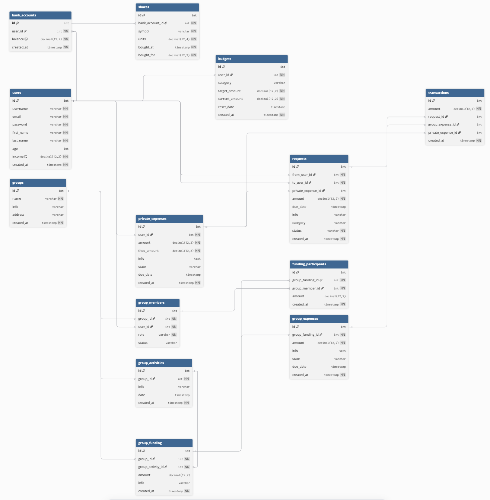

# FinanzApp 🚀💸📊

Willkommen zur aktuellen Projekt-README 🎯  
Ein zentraler Server steuert alle Module 🧠⚙️

## Module (aktuell) 🧩
- Login: `/` 🔐
- Dashboard: `/dashboard.html` 📈
- Gruppen: `/groups/` 👥
- Aktien: `/aktien/` 📉
- Fragen: `/fragen/` ❓
- Konten: `/konten/` 🏦

## Voraussetzungen ✅
1. Node.js 18+ 🟢
2. Laufende MongoDB (lokal oder Atlas) 🍃
3. `.env` im Projekt-Root 📄

## Installation 📦
```bash
npm install
```

## `.env` Beispiel 🔧
```env
MONGODB_URI="mongodb+srv://<user>:<password>@<cluster-host>/?appName=FinanzApp"
MONGODB_DB="finanzapp"
MONGODB_DB_V4="finanzapp_v4"

SESSION_TTL_MINUTES="180"
TWELVE_DATA_API_KEY="<dein_key>"
EXCHANGE_RATE_API_KEY="<dein_key>"

SMTP_HOST=""
SMTP_PORT="587"
SMTP_SECURE="false"
SMTP_USER=""
SMTP_PASS=""
SMTP_FROM=""
EMAIL_CODE_TTL_MINUTES="15"
DEV_EXPOSE_VERIFICATION_CODE="true"
```

## Datenbank vorbereiten 🗄️
```bash
npm run schema:setup
npm run seed:reset
```

Optional:
```bash
npm run seed:family-demo
```

## Starten ▶️
```bash
npm run backend:start
```

Danach:
- `http://localhost:3000/` 🔐
- `http://localhost:3000/dashboard.html` 📊
- `http://localhost:3000/groups/` 👥
- `http://localhost:3000/aktien/` 📉
- `http://localhost:3000/fragen/` ❓
- `http://localhost:3000/konten/` 🏦

## Nützliche Skripte 🛠️
- `npm run backend:start` (zentraler Server) ⚡
- `npm run schema:setup` / `npm run seed:reset` (v4 Standard) 🧱
- `npm run db:check` / `npm run db:wipe` / `npm run data:prepare` 🧪
- Versionierte Datensätze: `*:v2`, `*:v3`, `*:v4` 🧬

## Aktueller Datenstruktur-Stand 🧭🗂️


## Relevante Struktur 📁
```text
FinanzApp/
  backend/server.mjs
  uebersicht/
  groups/
  aktien/
  fragen/
  konten/
  shared/
  database/
    dataset-v2/
    dataset-v3/
    dataset-v4/
  Datastructure.png
```

## Hinweise 💡
- Standard-Runtime läuft auf **Dataset v4** (`MONGODB_DB_V4` oder `${MONGODB_DB}_v4`) 🧠
- Session-Cookie: `finanzapp_session` 🍪
- Ohne Session Redirect zurück auf `/` 🔁
